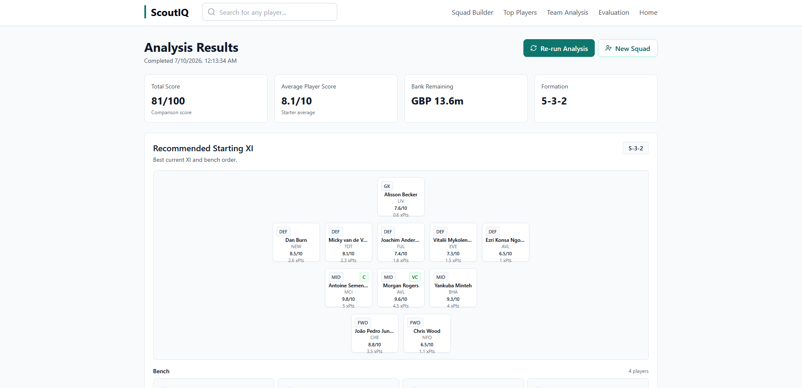
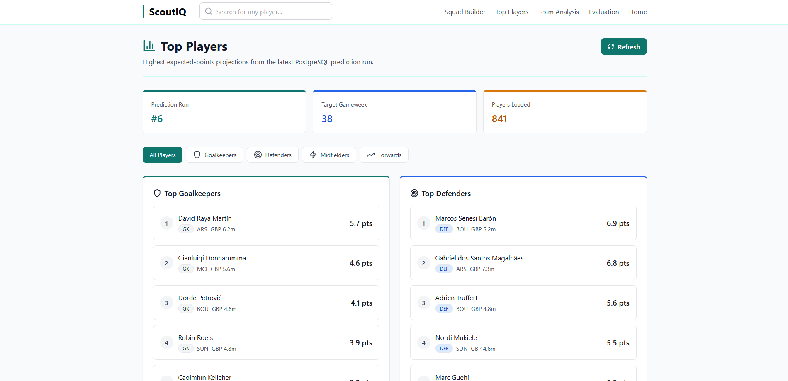
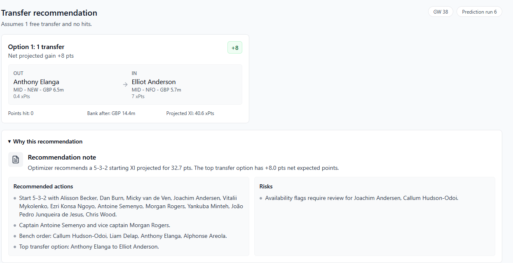
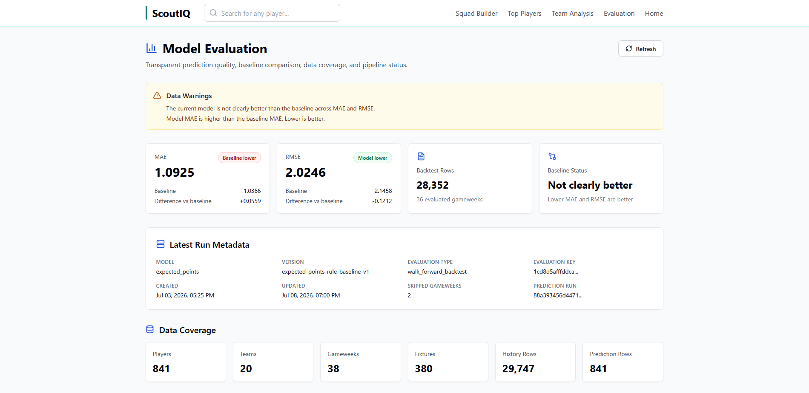

# ScoutIQ

[](../../actions/workflows/ci.yml)

ScoutIQ is a local-first Fantasy Premier League decision-support platform. It combines public-data ingestion, PostgreSQL-backed serving, leakage-aware expected-points evaluation, deterministic squad optimization, and an optional explanation-only LLM integration.

The project is designed as transparent portfolio evidence: recommendations remain rule-bound, model quality is reported against a baseline, and optional provider narrative cannot mutate or bypass deterministic optimizer output.

## What ScoutIQ Does

- ingests and validates official public FPL player, team, fixture, gameweek, and history data;
- preserves snapshot hashes, source metadata, row counts, and model-run lineage;
- builds local and PySpark Bronze/Silver/Gold data products;
- trains and walk-forward evaluates an interpretable expected-points baseline;
- serves predictions and evaluations from PostgreSQL through a typed Express API;
- recommends starting XIs, bench order, captaincy, transfers, and full squads under FPL constraints;
- explains existing optimizer output through validated provider JSON or deterministic fallback text; and
- exposes React views for squad building, player projections, optimizer results, and model evaluation.

## Architecture Overview

```text
Official FPL APIs
       |
       +--> TypeScript ingestion --> ignored local artifacts --> PostgreSQL
       |                                                    --> Express API --> React
       |
       +--> packaged public snapshot --> Databricks Bronze/Silver/Gold/Evaluation

Expected-points artifacts --> PostgreSQL --> deterministic optimizer --> explanation layer
```

PostgreSQL is the application serving store. Databricks is a separate offline transformation and evaluation path; it does not receive database credentials. See [Architecture](docs/ARCHITECTURE.md) for data flow and trust boundaries.

## Main Capabilities

- Deterministic ingestion with Zod validation and reproducibility metadata.
- PostgreSQL migrations, checksum tracking, typed loaders, and conflict-safe upserts.
- Prior-gameweek feature construction and walk-forward model evaluation.
- Prediction-backed optimization with position, formation, budget, club, transfer, and captaincy constraints.
- Grounded LLM explanations with schema validation, bounded provider calls, and deterministic fallback.
- API hardening with strict request schemas, bounded bodies and URLs, security headers, CORS allowlisting, and global plus expensive-route rate limits.
- A four-task Databricks Job that produced 19 managed Unity Catalog Delta tables in the verified portfolio run.

## Technology Stack

- TypeScript, Express, Zod, React, Vite
- PostgreSQL and SQL migrations
- Python, PySpark, Delta Lake, Unity Catalog
- Databricks Jobs and Declarative Automation Bundles
- Docker Compose, pnpm, GitHub Actions

## Screenshots

| Analysis Results | Top Players |
| --- | --- |
|  |  |

| Optimizer Results | Model Evaluation |
| --- | --- |
|  |  |

The screenshots contain public or generated local demo data. Their displayed metrics are illustrative local state; [Résumé Evidence](docs/RESUME_EVIDENCE.md) is the only canonical claim source. Review every new capture for credentials, workspace details, and personal identifiers before committing it.

## Local Setup

Prerequisites: Node.js 20, pnpm 9, Docker Compose, Python 3.12, and Java 17 for local PySpark tests.

```sh
pnpm install --frozen-lockfile
python3 -m venv .venv
node scripts/run-python.mjs -m pip install --requirement requirements-dev.txt
cp .env.example .env
```

Fill the required local database password blank in `.env`, then prepare the serving data:

```sh
docker compose up -d postgres
pnpm run db:migrate
pnpm run ingest:fpl
pnpm run db:load:fpl
pnpm run ingest:fpl:history
pnpm run pipeline:features
pnpm run model:train
pnpm run model:backtest
pnpm run model:predict
pnpm run db:load:predictions
```

Start the API and web app:

```sh
pnpm run dev:app
```

Open `http://localhost:3000`; the API health endpoint is `http://localhost:3001/api/health`. Live OpenAI or Azure OpenAI configuration is optional because explanation fallback works without provider credentials.

On Windows PowerShell, create the environment with `py -3 -m venv .venv`, use `pnpm.cmd`, and use `Copy-Item .env.example .env` for the equivalent commands.

## Tests And Security Checks

```sh
pnpm run build
pnpm run test:api
pnpm run test:smoke
pnpm run pipeline:test
pnpm run databricks:test
pnpm run databricks:snapshot:test
pnpm run model:test
pnpm run resume:metrics:test
pnpm run security:secrets
pnpm run security:check
```

`security:check` is the consolidated local/CI-oriented security entry point. See [Security](docs/SECURITY.md) for its scope, individual audit commands, environment practices, deployment assumptions, and residual risks. The repository workflow is linked above; no hosted run status is claimed here.

## Databricks Deployment

The Databricks path captures only public FPL data locally, uploads an ignored package to a managed Unity Catalog Volume, and runs `bronze -> silver -> gold -> evaluation` as dependent serverless tasks.

See [Databricks](docs/DATABRICKS.md) for prerequisites, bundle commands, table contracts, leakage controls, inspection queries, limitations, and cleanup. Verified counts and claim qualifications live in [Résumé Evidence](docs/RESUME_EVIDENCE.md).

## Known Boundaries

- ScoutIQ is a portfolio application, not a production security certification or formally penetration-tested service.
- The public API has no user accounts, cookies, or authorization layer; deploy it only within the assumptions documented in [Security](docs/SECURITY.md).
- The in-memory rate-limit store is suitable for one API process only.
- Batch ingestion, model generation, migrations, and data loading are operator-run jobs, not HTTP endpoints.
- The expected-points variant improved RMSE but not MAE in the recorded portfolio evaluation; no general model-superiority claim is made.
- Provider integrations are optional and mock-tested; live-provider deployment remains an operator responsibility.
- Databricks Free Edition is quota-limited, serverless-only, and has no production SLA.

## Canonical Documentation

- [Architecture](docs/ARCHITECTURE.md) — system boundaries, components, and data flow
- [Databricks](docs/DATABRICKS.md) — bundle deployment, Delta tables, verification, and limitations
- [Security](docs/SECURITY.md) — threat model, controls, configuration, checks, and residual risks
- [Résumé Evidence](docs/RESUME_EVIDENCE.md) — verified metrics and qualified technical claims

## License

MIT License — see [LICENSE](LICENSE).
