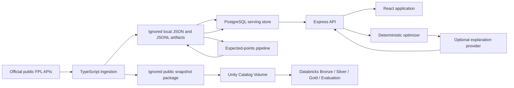

# ScoutIQ Architecture

This document owns ScoutIQ's system boundaries, component responsibilities, and data flow. Setup stays in the root README, Databricks operations stay in `DATABRICKS.md`, and security controls stay in `SECURITY.md`.

## System Context

The core serving-time trust boundaries are browser-to-API and API-to-PostgreSQL; live explanation mode adds API-to-provider. The provider is downstream of an already-computed optimizer result. Databricks is an offline analytics boundary and receives only the prepared public-data package.

## Repository Ownership

| Path | Responsibility |
| --- | --- |
| `apps/web` | React/Vite user interface and relative `/api` client |
| `apps/api` | Express routes, validation, database access, optimizer, and explanation orchestration |
| `db/migrations` | PostgreSQL schema and constraints |
| `pipelines/databricks` | Legacy local JSONL Bronze/Silver/Gold compatibility path |
| `pipelines/expected_points` | Feature generation, training, backtesting, and prediction |
| `src/scoutiq_databricks` | PySpark/Delta Bronze, Silver, Gold, and evaluation tasks |
| `databricks.yml`, `resources` | Declarative Automation Bundle and Job resources |
| `scripts` | Local workflow, packaging, smoke, evidence, and security helpers |
| `fixtures` | Small deterministic test inputs; not full-run evidence |
| `data`, `artifacts/resume_metrics.json` | Generated local outputs ignored by Git |

## Public Data Ingestion

The TypeScript ingestion code accepts data only from the official public FPL endpoints:

- `https://fantasy.premierleague.com/api/bootstrap-static/`
- `https://fantasy.premierleague.com/api/fixtures/`
- `https://fantasy.premierleague.com/api/element-summary/{player_id}/`

Raw responses are schema-validated and normalized into players, teams, gameweeks, fixtures, and player-gameweek history. Generated files live under ignored `data/fpl` paths.

The normalized manifest records source URLs, capture timestamps, season metadata, and record counts. PostgreSQL load planning and Databricks packaging derive deterministic snapshot hashes; the package also adds per-file SHA-256 metadata, and Bronze verifies exact file hashes and snapshot-hash linkage before ingestion.

## PostgreSQL Serving Layer

PostgreSQL is the source used by the HTTP application. Migrations define:

- normalized `teams`, `players`, `gameweeks`, `fixtures`, and `ingestion_runs` tables;
- expected-points model-run and player-output foundations; and
- `prediction_runs`, `player_predictions`, and `model_evaluations` serving tables.

Migration application is checksum-tracked. Loaders validate local artifacts, retain lineage, and use parameterized queries with conflict-safe updates. Replaying the same deterministic inputs updates the corresponding keys instead of creating duplicate logical runs.

Database migrations, ingestion, model generation, and database loading are operator-run batch commands. They are intentionally not exposed as HTTP maintenance endpoints.

## Local Lakehouse And Expected-Points Flow

The local compatibility pipeline under `pipelines/databricks` writes JSONL Bronze, Silver, and Gold outputs for fast development. The production-shaped PySpark implementation is separate and described in `DATABRICKS.md`.

The expected-points pipeline then:

1. builds current upcoming-fixture prediction rows and historical player-gameweek training rows;
2. trains an interpretable rule-based baseline;
3. performs walk-forward evaluation against a recent-points comparison baseline; and
4. writes prediction, model, and evaluation artifacts for loading into PostgreSQL.

If a completed-season snapshot has no upcoming fixtures, the local feature command deliberately emits the latest historical gameweek as a validation-only prediction slice. Those rows exercise the serving path; they are not live upcoming recommendations. The command reports `prediction_source=latest-historical-gameweek`, but the JSONL output does not persist that label, so screenshots and downstream claims must retain this qualification.

### Leakage controls

- A target gameweek never contributes to its own features.
- Rolling points and minutes use strictly earlier player-gameweeks.
- Double gameweeks are aggregated to player-gameweek grain before prior windows are calculated.
- Walk-forward evaluation trains or calibrates only on earlier gameweeks.
- Target points, target minutes, fixture outcomes, and post-event values remain outside model features.
- Boolean-like strings, booleans in numeric fields, and non-finite feature, target, or correction values are rejected.

The recorded portfolio evaluation is mixed: RMSE improved relative to the comparison baseline while MAE did not. Exact evidence and qualifications are in `RESUME_EVIDENCE.md`.

## API Surface

All HTTP routes are mounted below `/api` and return JSON. The route groups are:

| Group | Endpoints | Behavior |
| --- | --- | --- |
| Health | `GET /api/health` | Process/configuration status; no database mutation |
| Players | list, search, position, and ID lookups | PostgreSQL reads |
| Predictions | latest, player, gameweek, and top projections | PostgreSQL reads |
| Model | latest model evaluation | PostgreSQL read |
| Evaluation | latest, recent runs, and data health | PostgreSQL/local artifact reads |
| Analyze | squad analysis, validation, weights, and presets | Read-only computation plus prediction reads |
| Optimizer | starting XI, transfers, and full squad | Expensive deterministic computation plus prediction reads |
| Agent | public status and recommendation explanation | Status read or optional provider-backed explanation |

The POST routes do not modify application state: they analyze or optimize caller-supplied data. There are no user-account, ingestion, maintenance, upload, or administrator HTTP routes.

The expensive routes are `GET /api/evaluation/data-health`, `POST /api/analyze`, the three optimizer POST routes, and `POST /api/agent/explain-recommendation`. They receive a stricter rate limit in addition to the global limiter. Exact limits and schema bounds are documented in `SECURITY.md`.

## Prediction And Optimizer Flow

Prediction responses retain model-run, target-gameweek, fixture, and snapshot lineage. Per-fixture rows are aggregated deliberately before a player is optimized for a gameweek.

The optimizer implements three operations:

- starting XI, bench order, captain, and vice-captain selection from a valid 15-player squad;
- bounded transfer recommendations under free-transfer and points-hit settings; and
- full 15-player squad construction from a bounded candidate pool.

Constraints cover squad composition, formation, budget, bank, unique players, maximum players per club, transfer counts, and recommendation consistency. The optimizer is deterministic and does not call an LLM to make decisions.

## Explanation Boundary

The explanation route receives structured optimizer output after player and transfer decisions exist. Provider mode is optional.

Provider input/output is token/byte-bounded and schema-validated. Responses are checked for unsupported player references and structural inconsistency before display. Invalid, unconfigured, unavailable, or timed-out provider behavior produces a deterministic explanation fallback. These controls cannot prove that every free-text sentence faithfully summarizes the optimizer; provider text is narrative only and cannot mutate the returned optimizer result.

The React UI renders all explanation strings as ordinary React text. It does not use raw HTML injection.

## Frontend Flow

The Vite client uses same-origin relative `/api` requests with a 10-second Axios timeout. It does not call OpenAI, Azure OpenAI, Databricks, PostgreSQL, or FPL providers directly and does not read server environment variables.

The only interactive free-text input is player search, bounded to 100 characters in the client and validated again by the API. Player detail route IDs are parsed as canonical positive integers before a request is sent. Squad and analysis state is kept in browser session storage for navigation convenience; that storage is not treated as trusted, authenticated, or secret state.

React's default escaping remains the output boundary. There is no `dangerouslySetInnerHTML`, `eval`, dynamic code execution, browser credential storage, or user-controlled external URL fetch in `apps/web/src`.

## Local And Deployment Boundaries

Local development runs the Vite frontend, Express API, and Docker Compose PostgreSQL separately. The frontend development proxy forwards `/api` to the local API.

A hosted deployment must provide:

- one externally reachable API process or an external shared rate-limit store;
- a PostgreSQL service with migrations and current serving data loaded;
- same-origin `/api` routing or an explicit frontend-to-API rewrite;
- an exact HTTPS CORS allowlist;
- an exact trusted-proxy IP/CIDR configuration when a known reverse proxy is present;
- platform secret storage, TLS, logging, monitoring, backups, and scheduled batch jobs; and
- separate security headers for the static frontend host when it is not served by Express.

`docker-compose.yml` provisions local PostgreSQL only. The Vercel descriptors are partial build/route descriptors, not evidence of a complete production deployment.
