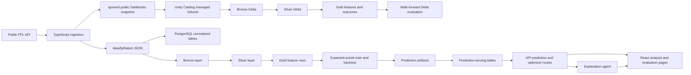

# ScoutIQ Architecture

This document describes the current repository architecture and local data flow. It is intended for technical reviewers who want to understand how ingestion, modelling, optimization, explanation, and the web demo fit together.

## Repository Structure

```text
apps/
  api/                 Express and TypeScript API
  web/                 React and Vite frontend
db/
  migrations/          PostgreSQL schema migrations
docs/                  Architecture, setup, pipeline, and demo docs
fixtures/
  agent/               Local explanation-agent request fixtures
pipelines/
  databricks/          Legacy local JSONL Bronze, Silver, Gold pipeline scripts
  expected_points/     Feature, train, backtest, predict, and test scripts
src/
  scoutiq_databricks/  PySpark and Delta Bronze, Silver, Gold, evaluation tasks
resources/             Databricks Job, schema, and Volume bundle resources
databricks.yml         Declarative Automation Bundle entry point
scripts/               Windows-friendly local workflow helpers
data/                  Gitignored local ingestion, feature, model, and prediction outputs
```

The normal local application path is `apps/api` plus `apps/web`. Expected-points training, backtesting, and prediction generation run through the `pipelines/` commands and load outputs into PostgreSQL.

## High-Level Flow



## Data Ingestion To Database

The ingestion entry points live in `apps/api/src/ingestion`.

- `pnpm.cmd run ingest:fpl` fetches public bootstrap and fixture data.
- `pnpm.cmd run ingest:fpl:history` fetches public player gameweek history.
- Normalized records are written under `data/fpl/latest` and `data/fpl/history`.
- The manifest preserves source URLs, fetch timestamps, season metadata, record counts, and a deterministic snapshot hash.

PostgreSQL loading is handled by `apps/api/src/db`.

- `pnpm.cmd run db:migrate` applies SQL files from `db/migrations`.
- `pnpm.cmd run db:load:fpl` loads teams, players, gameweeks, fixtures, and ingestion run metadata.
- `pnpm.cmd run db:load:predictions` loads prediction runs, player predictions, and model evaluation summaries.

The database gives the API a stable serving layer while local pipeline artifacts remain gitignored.

## Bronze, Silver, And Gold Pipelines

The legacy local JSONL pipeline lives in `pipelines/databricks`. It remains useful for fast local development and compatibility with the existing expected-points pipeline.

The genuine Databricks implementation lives in `src/scoutiq_databricks` and is deployed through `databricks.yml` plus `resources/scoutiq_job.yml`.

- Bronze reads an uploaded public package from a managed Unity Catalog Volume and writes source-preserving managed Delta tables.
- Silver reads Bronze, parses explicit schemas, validates references, and deduplicates deterministically.
- Gold reads Silver, aggregates double gameweeks before prior-only windows, and keeps model features separate from target-gameweek outcomes.
- Evaluation reads Gold, applies a strict earlier-gameweek walk-forward split, compares the model with a recent-points baseline, and writes Delta predictions, metrics, and run evidence.

Databricks remains an offline transformation and analytics layer. PostgreSQL remains the serving database used by the API and optimizer.

## Model Training, Backtesting, And Prediction

The expected-points pipeline lives in `pipelines/expected_points`.

- `features.py` builds current prediction rows and historical training rows.
- `train.py` trains the expected-points baseline model.
- `backtest.py` runs walk-forward evaluation with a historical baseline comparison.
- `predict.py` writes current prediction rows for serving.
- Tests under `pipelines/expected_points/tests` check feature and evaluation behavior.

The current backtest is mixed rather than clearly better than baseline: MAE is worse than baseline, while RMSE is better. The project reports this as a limitation.

## Prediction Serving Layer

Prediction serving is documented in `docs/PREDICTION_SERVING.md` and implemented in `apps/api/src/db` plus `apps/api/src/routes`.

Primary API surfaces include:

- `GET /api/predictions/latest`
- `GET /api/predictions/player/:playerId`
- `GET /api/predictions/gameweek/:gameweekId`
- `GET /api/predictions/top`
- `GET /api/model/evaluations/latest`
- `GET /api/evaluation/latest`
- `GET /api/evaluation/runs`
- `GET /api/evaluation/data-health`

Prediction responses include run metadata so downstream recommendations can be traced to the model output and source snapshot used.

## Optimizer Flow

Optimizer logic lives in `apps/api/src/optimizer` and is exposed through `apps/api/src/routes/optimizer.ts`.

The implemented optimizer endpoints are:

- `POST /api/optimizer/starting-xi`
- `POST /api/optimizer/transfers`
- `POST /api/optimizer/squad`

The optimizer consumes prediction-backed player candidates and applies deterministic FPL constraints such as squad size, positions, budget, formations, club limits, captaincy, and bench order. It does not call the LLM explanation layer and does not rely on random or mock recommendation data.

## Explanation Agent Flow

The explanation layer lives in `apps/api/src/agent` and is exposed through `apps/api/src/routes/agent.ts`.

The implemented agent endpoints are:

- `GET /api/agent/status`
- `POST /api/agent/explain-recommendation`

The agent receives optimizer result JSON after the optimizer has already made decisions. Provider output is schema-validated and checked for unsupported player references before it can be returned. If provider mode is disabled, unconfigured, unavailable, invalid, or unsafe, the API returns deterministic fallback explanation output instead.

The agent explains but does not decide. It does not choose players, transfers, captaincy, bench order, or chips.

## Evaluation Dashboard Flow

The web evaluation page is `apps/web/src/pages/EvaluationPage.tsx`. It reads the evaluation API routes to display:

- latest backtest metrics
- comparison against baseline MAE and RMSE
- coverage counts for loaded data
- prediction run metadata
- setup warnings when evaluation or prediction data is missing
- current limitations

The dashboard is a transparency surface. It does not claim model superiority unless both tracked error metrics beat the baseline.

## Local Development Flow

The default reviewer and development path is:

```powershell
pnpm.cmd install
if (!(Test-Path .env)) { Copy-Item .env.example .env }
if (!(Test-Path apps\api\.env)) { Copy-Item apps\api\.env.example apps\api\.env }
docker compose up -d postgres
pnpm.cmd run db:migrate
pnpm.cmd run ingest:fpl
pnpm.cmd run db:load:fpl
pnpm.cmd run ingest:fpl:history
pnpm.cmd run pipeline:features
pnpm.cmd run model:train
pnpm.cmd run model:backtest
pnpm.cmd run model:predict
pnpm.cmd run db:load:predictions
pnpm.cmd run dev:app
```

`pnpm.cmd run dev:app` starts the API and web app only. It does not require an OpenAI API key.

Useful local validation commands:

```powershell
pnpm.cmd run build:api
pnpm.cmd run test:api
pnpm.cmd run test:smoke
pnpm.cmd run pipeline:test
pnpm.cmd run model:test
pnpm.cmd run build
pnpm.cmd run build:web
```
